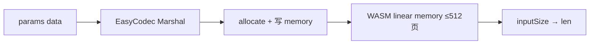

# run_testbiginput — bigInput 大参数输入测试

在 vmwasmer 单元测试环境中调用 `bigInput` 合约的 `inputSize` 方法，阶梯扫描不同大小的 `data` 参数，观测单实例 WASM 线性内存扩张与执行结果。

## 快速开始

```bash
cd /home/projects/CVW/chainmaker/cmd/run_testbiginput

# 编译插桩版 wasm 并跑默认阶梯（单参数 inputSize）
go run . -build

# 分片版 inputSizeMulti（默认阶梯至 64MB 总 data，每片 ≤1MB）
go run . -build -multi

# 单点测试 1MB（单参数）
go run . -size=1048576

# 分片总 4MB（自动拆成 4×1MB）
go run . -multi -size=4194304

# 自定义阶梯
go run . -sweep=1024,65536,1048576,8388608
go run . -multi -sweep=2097152,8388608,16777216,33554432,67108864
```

> **注意**：vmwasmer 单元测试要求 wasm 导出 `SetGas`/`GetGas`，默认使用 `testdata-instrument/bigInput` 插桩版（`-instrumented=true`）。纯版 `testdata/bigInput` 仅用于链上 cmc 部署。

报告输出：
- 单参数：`chainmaker/bigInputReport.csv`
- 分片：`chainmaker/bigInputMultiReport.csv`

### inputSizeMulti 分片协议

| 参数 | 说明 |
|------|------|
| `part_count` | 分片数量 N（字符串十进制） |
| `data0` … `data{N-1}` | 每片 ≤1MB（EasyCodec `MAX_VALUE_LEN`） |

测试工具按总字节数自动切片：`ceil(total/1MB)` 个 shard。

---

## 单实例线性内存扩张机制（vmwasmer）

### 1. 两种「扩张」不要混淆

| 概念 | 含义 | 代码位置 |
|------|------|----------|
| **实例池扩张（pool grow）** | 并发不够时**多建** WASM 实例 | `vm_pool.go` `grow()` / `shouldGrow()` |
| **单实例线性内存扩张（memory grow）** | 一个实例内 WASM `memory` **变大** | Wasmer `MaxPagesLimit` + 合约 `allocate` / `memory.grow` |

本工具测的是第二种。

### 2. 硬上限：512 页 ≈ 32MB

```go
// vm_pool.go — 创建 vmPool 时
config.MaxPagesLimit(512)  // 默认 256 页 = 16MB，当前改为 512 页
```

- 1 页 = **64KB**（`WasmPageSize = 0x10000`）
- **512 页 ≈ 32MB**：单个 WASM 实例线性内存上限
- 超过后 `allocate` 失败，日志常见：`There may not be enough memory or CPU`

### 3. 大参数进入 VM 的路径

```
交易 params → EasyCodec 序列化 → allocate(N) → Host 写入 memory[dataPtr..]
→ 合约 ArgString("data") → len(data) 返回
```

关键代码（`sim_context.go`）：

1. `lengthOfSubject := len(ec.Marshal())` — 序列化后参数字节数
2. `allocateFunc.Call(lengthOfSubject)` — 合约内分配，触发 `memory.grow`
3. Host 逐字节写入 `exportMemory.Data()[dataPtr:]`
4. 调用 `inputSize` 导出函数

大参数在 VM 内至少占：**序列化缓冲区 + `data` 字符串副本**（Go WASM 下 string 会再占一份）。

### 4. 合约内再扩张

Go/TinyGo 编译的 WASM 在 `allocate`、堆分配、`string` 增长时发 **`memory.grow`**，由 Wasmer 在 `MaxPagesLimit` 内扩页。

### 5. 单次调用后实例生命周期

当前 `RevertInstance` 带 `|| true`（测试开关），**每次 invoke 后销毁并重建实例**：

- 不会跨调用累积大内存
- 单次调用峰值仍受 32MB 约束
- 日志可看：`exportMemory datasize X字节 Y页`（`runtime.go`）

### 6. 数据流



---

## 命令行参数

| 参数 | 默认 | 说明 |
|------|------|------|
| `-build` | false | 先编译 wasm（默认插桩版） |
| `-instrumented` | true | 使用 `testdata-instrument/bigInput`（vmwasmer 必需） |
| `-size` | 0 | 单次测试 data 字节数 |
| `-sweep` | 空 | 逗号分隔的阶梯，如 `1024,1048576` |
| `-name` | bigInput | 合约名（对应 `testdata/<name>-<type>.wasm`） |
| `-type` | go | wasm 后缀 |
| `-method` | 空 | 默认 `inputSize`；`-multi` 时为 `inputSizeMulti` |
| `-multi` | false | 分片模式，方法 `inputSizeMulti` |
| `-report` | bigInputReport.csv | CSV 报告路径（相对 chainmaker/） |

无 `-size` 且无 `-sweep` 时：

- **inputSize**：`1KB → 64KB → 1MB → 1.5MB → 4MB → 8MB`
- **inputSizeMulti（-multi）**：`1KB → 64KB → 2MB → 4MB → 8MB → 10MB → … → 64MB`（总字节，自动分片；>8MB 在当前 MaxPagesLimit=512 下预期失败，用于探边界）

## 实测边界（解读终端报告）

根据 `go run . -build` 默认阶梯的实际输出，失败分 **两类**，且都早于 `MaxPagesLimit(512页≈32MB)`：

### 边界一：EasyCodec 单值上限 1MB（4MB～16MB 失败原因）

合约 SDK 反序列化时有硬编码限制：

```go
// contract-sdk-go-wasm/sdk/easycodec.go
MAX_VALUE_LEN = 1024 * 1024  // 1MB
```

`EasyUnmarshal` 中若 `valueLength > MAX_VALUE_LEN` 会直接 `return items`（空列表），导致 `ArgString("data")` 返回 ERROR → 合约报 `missing or invalid param: data`。

| data 大小 | 现象 | 说明 |
|-----------|------|------|
| ≤ 1MB | PASS | `lengthOfSubject` ≈ data + 系统参数开销 |
| 4MB～16MB | FAIL，`missing or invalid param: data` | Host `allocate` 成功、`contract invoke success`，但 SDK 解析丢弃了大 value |
| 内存 | 仍随输入增长 | 如 8MB 输入 → 320 页(20MB)，16MB → 448 页(28MB) |

**结论**：当前 Go WASM 合约通过 EasyCodec 传参，**单个参数 value 实际上限约 1MB**，不是 32MB。

### 边界二：WASM 内 allocate OOM（24MB+ 失败原因）

当 `lengthOfSubject` 超过约 25MB 时，合约 SDK 的 `allocate(size)` 在 WASM 内 `make([]byte, size)` 触发：

```
runtime: out of memory: cannot allocate 29360128-byte block
contract invoke allocate failed, WASI exited with code: ExitCode::2
```

此时连参数缓冲区都建不出来，`actual` 为空、`gas=0`。

### 内存基线与扩张（PASS 阶段）

即使 1KB 输入，`exportMemory` 也常显示 **8MB / 128 页**——这是 Go WASM 运行时 + 模块初始 memory 的基线，不代表参数本身占 8MB。随 data 增大，页数阶梯上升（128 → 256 → 320 → 448）。

### 建议测试阶梯

```bash
# 精确定位 1MB 边界
go run . -sweep=1048576,1048577,1572864,2097152

# 观察内存扩张（不超过 SDK 上限）
go run . -sweep=1024,65536,262144,524288,1048576
```

若要测真正的大参数（>1MB），需修改 SDK 的 `MAX_VALUE_LEN` 或改用非 EasyCodec 传参路径。

## 报告字段

| 列 | 含义 |
|----|------|
| data_size | 输入 data 字节数 |
| ok | 返回长度是否与 data_size 一致 |
| gas | 合约 gas 消耗 |
| exec_time_sec | CallMethod 耗时（秒） |
| mem_bytes / mem_pages | invoke 后线性内存（来自 runtime 日志） |

## 观测日志

测试时关注 vm-wasmer 输出：

| 日志 | 含义 |
|------|------|
| `lengthOfSubject: N` | 序列化参数总字节 |
| `allocate ... not enough memory` | VM 分配失败 |
| `exportMemory datasize X字节 Y页` | 单次 invoke 后内存占用 |
| `[biginput-result] ...` | 本工具结构化结果行 |

## 链上测试（cmc）

本工具走 vmwasmer 单元测试，不依赖链节点。若要在真实链上测：

```bash
cd /home/projects/CVW/chainmaker/testdata/bigInput
./build.sh bigInput go

# 用 Python 生成大 params，避免 yaml 塞不下 MB 级字符串
python3 -c "
import json, subprocess
size = 1024 * 1024
subprocess.run(['./cmc', 'client', 'contract', 'user', 'invoke',
  '--contract-name=bigInput', '--method=inputSize',
  '--sdk-conf-path=./sdk_config.yml',
  f'--params={json.dumps({\"data\": \"X\"*size})}',
  '--sync-result=true'], check=False)
"
```

链上还需注意 RPC `max_recv_msg_size`（通常 100MB）。但 Go WASM 合约侧 EasyCodec **单值上限 1MB** 往往比 VM 32MB 更紧。

## 测 >32MB 输入

需修改 `vm_pool.go` 中 `MaxPagesLimit` 并重新编译节点，例如：

```go
config.MaxPagesLimit(1024) // 64MB
```

同时确认 RPC 消息上限与 Go WASM 编译 max pages 配置。
